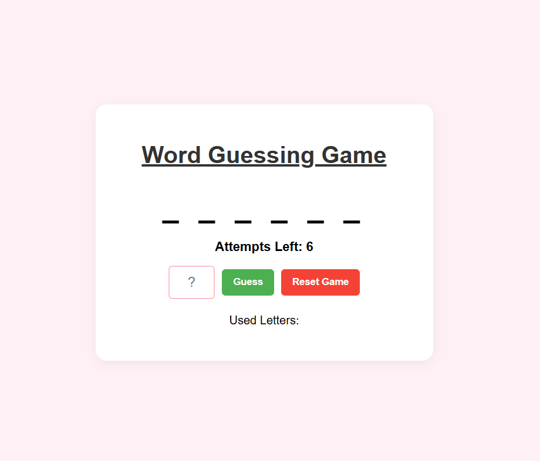
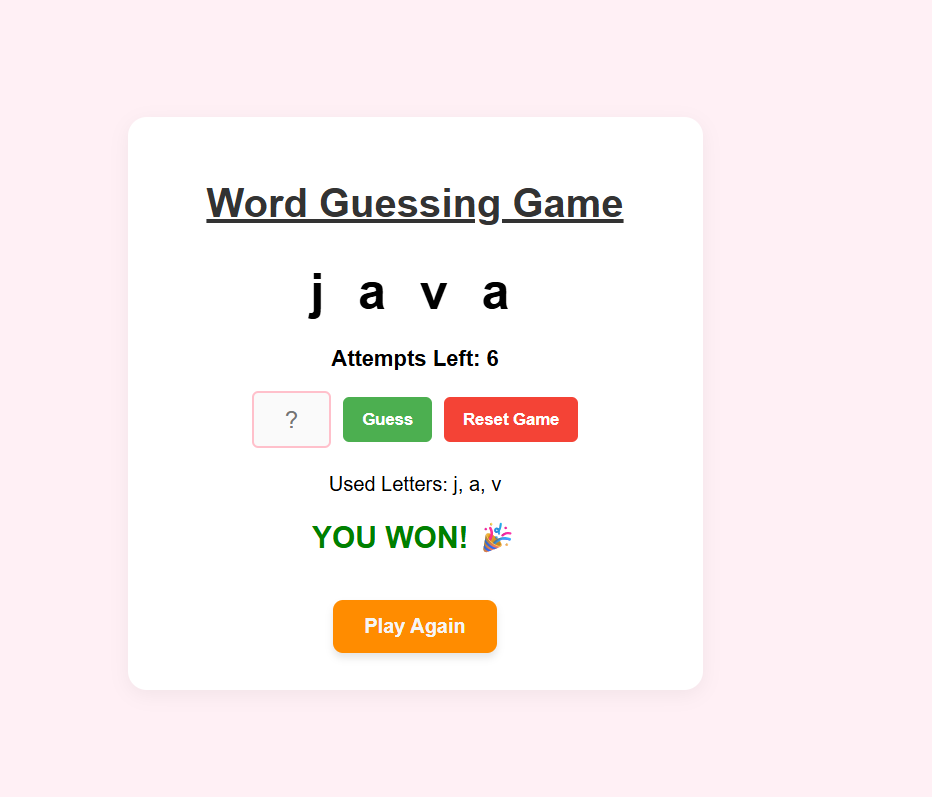

# 🎮 Word Guessing Game

A stylish Word Guessing game built with **Python (Flask)**, **HTML5**, **CSS3**, and **JavaScript**.

## 📸 Screenshots
| Home Screen | You Won! |
| :---: | :---: |
|  |  |

## ✨ Features

* **Responsive UI:** A beautiful pink theme that works smoothly on different screen sizes.
* **Dual-Control Buttons:** * **Guess Button:** To submit your letter.
    * **Reset Game Button:** Stuck? Use this to clear the session and pick a brand-new word instantly.
* **Live Tracking:** * **Attempts Left:** Watch your 6 lives decrease as you guess incorrectly.
    * **Used Letters:** Displays all the letters you've already tried so you don't repeat mistakes.
* **Smart Game Logic:**
    * **Win State:** If you guess the word, you are greeted with a "YOU WON! 🎉" message and a **Play Again** button appears.
    * **Lose State:** If attempts reach zero, the game reveals the secret word and informs you that you've lost.

## 🛠️ How to Run
1. Install Flask: `pip install flask`
2. Run the app: `python app.py`
3. Open in browser: `http://127.0.0.1:5000` or 'http://localhost:5000/'